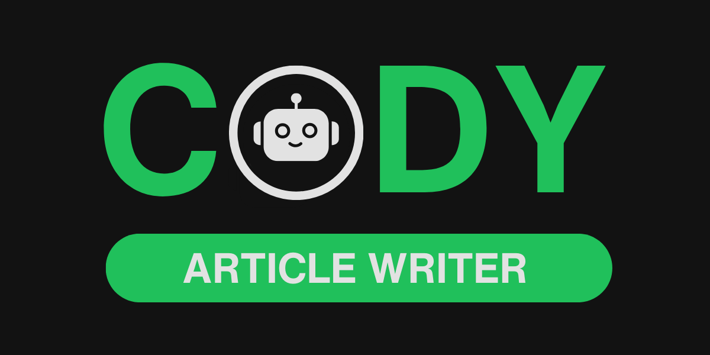
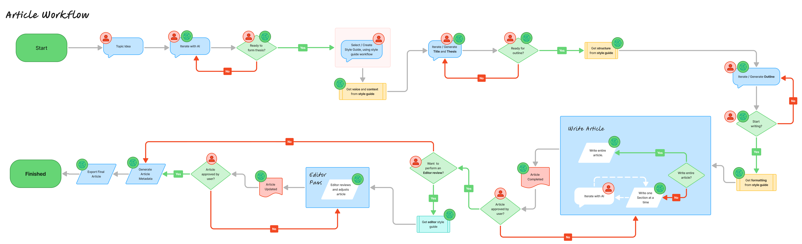
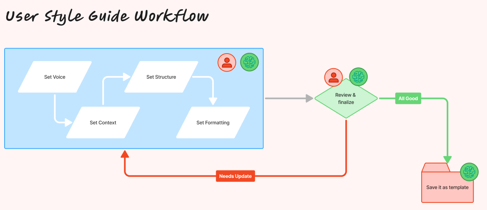
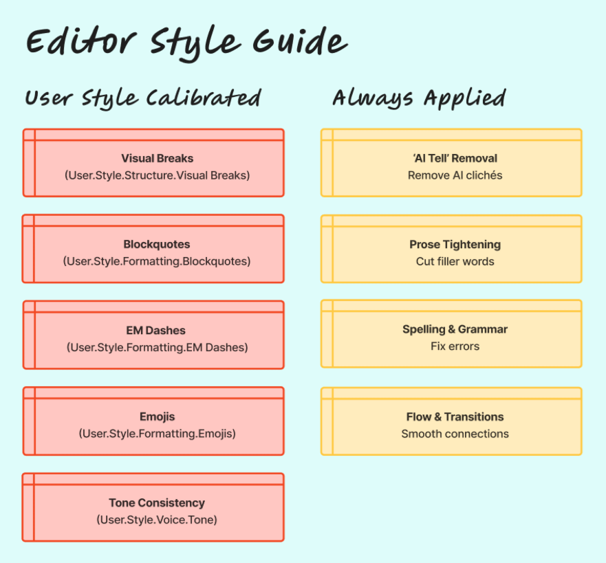

# Cody Article Writer



[](Release%20Notes.md)
[](LICENSE.md)
[](https://www.ibuildwith.ai)

## Join our Discord Server
Get the latest updates, news, and more by [joining our Discord community](https://discord.gg/Mz7vdRmpJH).

## Star the Repo
⭐⭐ **If you find this skill helpful, please star this repo to show your support!** ⭐⭐

## About Cody Article Writer
Cody Article Writer is an AI Agent Skill (following the [agentskills.io](https://agentskills.io/specification) specification) that transforms how you write articles. Instead of staring at a blank page, you collaborate with AI through a structured, iterative workflow with **web research, source citations**, and customizable style guides. Each phase includes iteration loops where nothing moves forward until you're satisfied - from topic ideation with research all the way to markdown export with optional citations.

## Download

Download the [cody-article-writer.skill](cody-article-writer.skill) file.

## Installation

### Claude AI Desktop App

1. Double-click the downloaded `.skill` file or "Open with Claude AI"
2. Start writing: "I want to write an article about..."

Learn more [here](https://support.claude.com/en/articles/12512180-using-skills-in-claude).

### Claude AI Web

1. Click on your username
2. Click on settings
3. Click on capabilities
4. Scroll down to "Skills"
5. Click on "+ Add"
6. Click on "Upload a skill"
7. Drag and drop the skill into the box.

Learn more [here](https://support.claude.com/en/articles/12512180-using-skills-in-claude).

### Claude Code

```bash
# Project Level
unzip cody-article-writer.skill -d .github/skills/

# User Home
unzip cody-article-writer.skill -d ~/.claude/skills/
```

Extract to your skills folder. Learn more [here](https://code.claude.com/docs/en/skills).

### GitHub Copilot (VS Code, CLI, Copilot Agent)

```bash
# Github Folder
unzip cody-article-writer.skill -d .github/skills/

# Claude Folder (Legacy Support)
unzip cody-article-writer.skill -d .claude/skills/
```

Extract to your skills folder. Learn more [here] (https://code.visualstudio.com/docs/copilot/customization/agent-skills).

### Open AI Codex

```bash
# Project
unzip cody-article-writer.skill -d .codex/skills/

# User Home
unzip cody-article-writer.skill -d ~/.codex/skills/

# Admin
unzip cody-article-writer.skill -d /etc/codex/skills
```

Extract to your skills folder. Learn more [here](https://developers.openai.com/codex/skills/).

## Article Workflow

1. **Topic Ideation** — Refine rough concepts with AI brainstorming and exploratory web research
2. **Research Planning** (optional) — Gather comprehensive sources, set citation preferences, mark required vs. optional sources
3. **Style Selection** — Choose or create reusable style guides that capture your voice
4. **Title & Thesis** — Craft compelling titles and clear thesis statements using research
5. **Outline** — Structure your article with opening/closing strategies informed by sources
6. **Write Article** — Choose your writing mode and write with inline citations from approved sources
7. **Article Approval** — Review and approve the completed article before moving forward
8. **Editor Pass** (optional) — AI-powered editing for formatting and polish (citations preserved)
9. **Add Metadata** — Generate title, description, and keywords for frontmatter
10. **Export Article** — Choose filename and whether to include citations/references section



## Example Commands

| Command | Action |
|---------|--------|
| "write an article about X" | Start article workflow |
| "continue my article" | Resume most recent draft |
| "continue the X article" | Resume specific draft |
| "show my drafts" | List in-progress articles |
| "show my articles" | List exported articles |
| "list my writing styles" | List available style guides |
| "create a new article style" | Start style guide workflow |
| "edit my X style" | Modify existing style |
| "delete the X style" | Remove style guide |
| "show my archive" | List completed draft states |
| "re-export the X article" | Re-export from archive |

## Features

### Research, Source Management & Citations

Write research-backed articles with comprehensive source tracking and optional citations. This feature is built on three pillars:

#### 1. Research Workflow

- **Exploratory Research** (always on) — AI performs web searches during topic ideation to inform your angle with current data
- **Comprehensive Research** (optional) — Gather authoritative sources before writing using WebSearch and WebFetch
- **Multi-phase Integration** — Research informs topic ideation, thesis development, outline structure, and article writing

#### 2. Source Management

- **Approval System** — Review and approve all sources before AI uses them in your article
- **Required vs. Optional** — Mark sources as required (must incorporate) or optional (use if relevant)
- **Rich Metadata** — Track source URLs, titles, authors, dates, excerpts, and relevance notes
- **Archive Preservation** — All sources preserved in JSON archive for potential re-export with different citation preferences

#### 3. Citations

- **Inline Markers** — AI inserts `[^1]`, `[^2]` citation markers as it references sources during writing
- **References Section** — Auto-generated bibliography from cited sources using footnote format
- **Export Choice** — Decide at export whether to include citations or publish without them (sources remain archived)
- **Editor Preservation** — Editorial pass does not modify citation markers or references

### Customizable Style Guides

Create and save style guides that capture your unique voice:

- **Voice** — Tone (casual to professional), humor level, opinion strength, technical depth
- **Formatting** — Emoji usage, em dash frequency, blockquote preferences
- **Structure** — Opening/closing styles, visual breaks (white space), example preferences (lists, tables, diagrams, code, quotes, case studies)
- **Context** — Author role, audience role, expertise levels, relationship dynamics

Style guides are applied progressively throughout the workflow:
- **Voice + Context** during thesis development
- **Structure** during outline creation
- **Formatting** during section writing
- **Content enhancement** during editorial review (examples, blockquotes)




### Iterative Workflow

Every phase includes iteration loops. AI acts as a firm sounding board, providing honest feedback and challenging weak ideas. Nothing moves forward until you're satisfied:

- Topic ideation with AI brainstorming
- Title and thesis refinement
- Outline structuring
- Article writing (section-by-section or full draft first)
- Article approval and review
- Optional editorial polish

### Editor Pass

An optional AI editing phase calibrated to your style guide that:

- **Content enhancement** — Suggests contextual examples (tables, code snippets, diagrams) and blockquotes based on your style preferences
- **Visual breaks** — Applies your preferred paragraph spacing and white space settings
- **Text emphasis** — Adds strategic bold and italic formatting following editorial best practices
- **AI tell removal** — Removes common AI patterns ("Additionally", "It's important to note...", excessive em dashes)
- **Prose tightening** — Fixes grammar, improves flow, strengthens weak verbs
- **Tone consistency** — Ensures your voice remains consistent throughout
- **Original preserved** — Your unedited draft is always saved as backup



### State Persistence

Your work is automatically saved throughout the entire process. Stop anytime and pick up exactly where you left off:

- **Resume at any phase** - Your current phase, topic, thesis, outline, and completed sections are preserved
- **Preview as you write** - See a readable markdown file of your work-in-progress without scrolling through chat
- **Complete article history** - Every finished article is archived with its original idea, thesis, sections, and metadata for potential re-export
- **No lost work** - All style guides are saved and reusable across articles

### Centralized Project Storage

All Cody Skills store their outputs in a single `cody-projects/` directory in your working folder. This keeps all your AI-assisted work organized in one place:

- `cody-projects/article-writer/` - Articles, styles, drafts, and archives from Cody Article Writer
- `cody-projects/product-builder/` - Product projects from Cody Product Builder
- Additional Cody Skills will add their own subdirectories

This centralized approach makes it easy to find all your Cody-generated work, back up your projects, and manage outputs across different skills.

## Collaboration Philosophy

Cody Article Writer acts as a **firm sounding board**, not a sycophant:

- **Honest feedback** — Provides constructive critique on weak ideas, doesn't flatter or excessively agree
- **Challenges assumptions** — Points out gaps, suggests alternatives, pushes back when needed
- **Objective assessment** — Maintains factual consistency regardless of how you phrase questions or whether you disagree
- **Quality over comfort** — Explicitly calls out when you're optimizing for speed at the expense of correctness or clarity
- **Transparent reasoning** — Clearly states assumptions and explains disagreements with specifics

Goal: Help you produce your best work through honest collaboration, not make you feel good through empty praise

## Requirements

- An AI coding assistant that supports Agent Skills (e.g., Claude AI, Claude Code, GitHub Copilot, OpenAI Codex)
- File system access for saving styles and drafts

## Skill Structure

The internal organization of the skill files that define the article writing workflow.

```
cody-article-writer/
├── SKILL.md                           # Main skill instructions
├── references/
│   ├── style-schema.md                # Style guide field definitions
│   ├── style-workflow.md              # Style creation workflow
│   ├── article-workflow.md            # Article writing phases
│   └── editor-style-guide.md          # Editorial pass guidelines
└── assets/
    └── templates/
        └── article_default.md         # Export template
```

## Project Structure

This structure is automatically created in your working directory when you start writing to store all your articles, drafts, and settings.

```
cody-projects/
└── article-writer/
    ├── articles/                      # Exported markdown articles
    ├── styles/                        # Custom style guides
    ├── drafts/                        # Work-in-progress articles
    └── archives/                      # Completed article history
```

## Author

**iBuildWith.ai**

© Copyright 2026 – Red Pill Blue Pill Studios, LLC – All Rights Reserved.

Part of the Cody family of AI Agent Skills:
- Cody Product Builder — Build products with AI
- Cody Article Writer — Write articles with AI

## License

Cody Article Writer is licensed under a custom license that permits free use for article writing and content creation (including commercial use), but prohibits redistribution, modification, and sale of the software itself.

See [LICENSE.md](LICENSE.md) for complete terms.

## Release Notes

See [Release Notes.md](Release%20Notes.md) for version history and updates.

## Links

- [iBuildWith.ai](https://www.ibuildwith.ai)
- [Agent Skills Specification](https://agentskills.io/specification)
